# smpe-admin-learn

#### 介绍
学习开源框架：https://github.com/shiwei-Ren/smpe-admin

前端框架暂时不打算学习（https://github.com/shiwei-Ren/smpe-admin-web）

# 准备数据库
数据库名 `smpe`

sql文件：
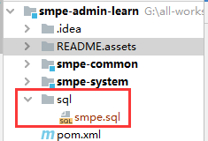

使用方法：
1. 打开 navicat 
2. 打开本地连接
3. 新建名为：`smpe`的库
4. 执行sql文件
5. 如图：

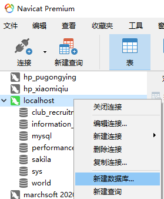

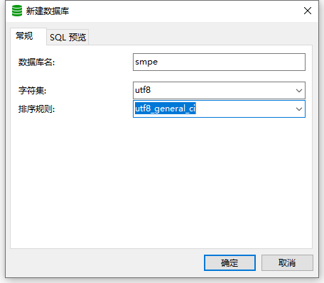

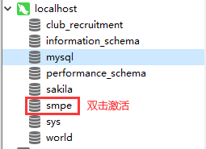

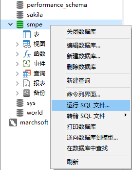

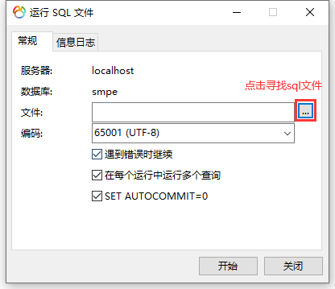

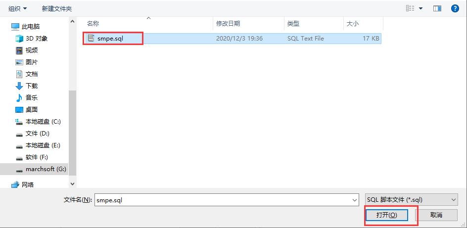

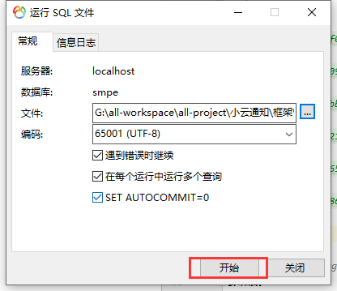

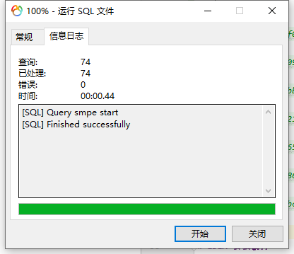

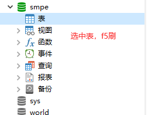

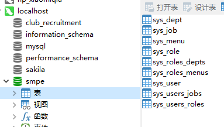
# IDEA 安裝插件 
安装插件 `Paste lmagesinto into Markdown`
安装后，
1. 可直接通过 ctrl + c 把图片文件复插入到 md 文件（支持目录自定义），香！
2. 上传远程仓库（码云等）后，不需要手动更改，图片的插入地址，直接显示，香！
3. 目录设置成 `/{document_name}.assets` 之后，还可以适配 Typora ，香！

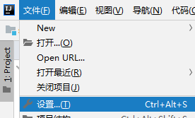

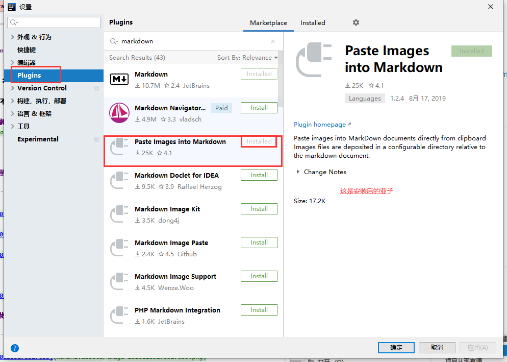

效果如图：
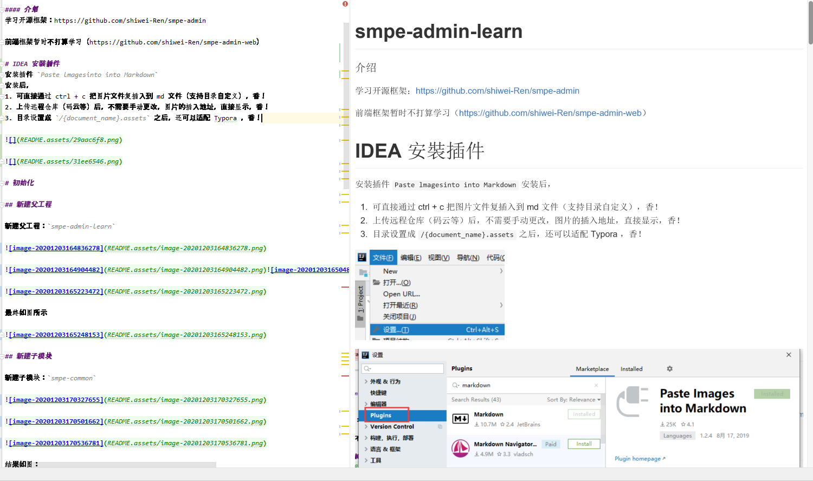
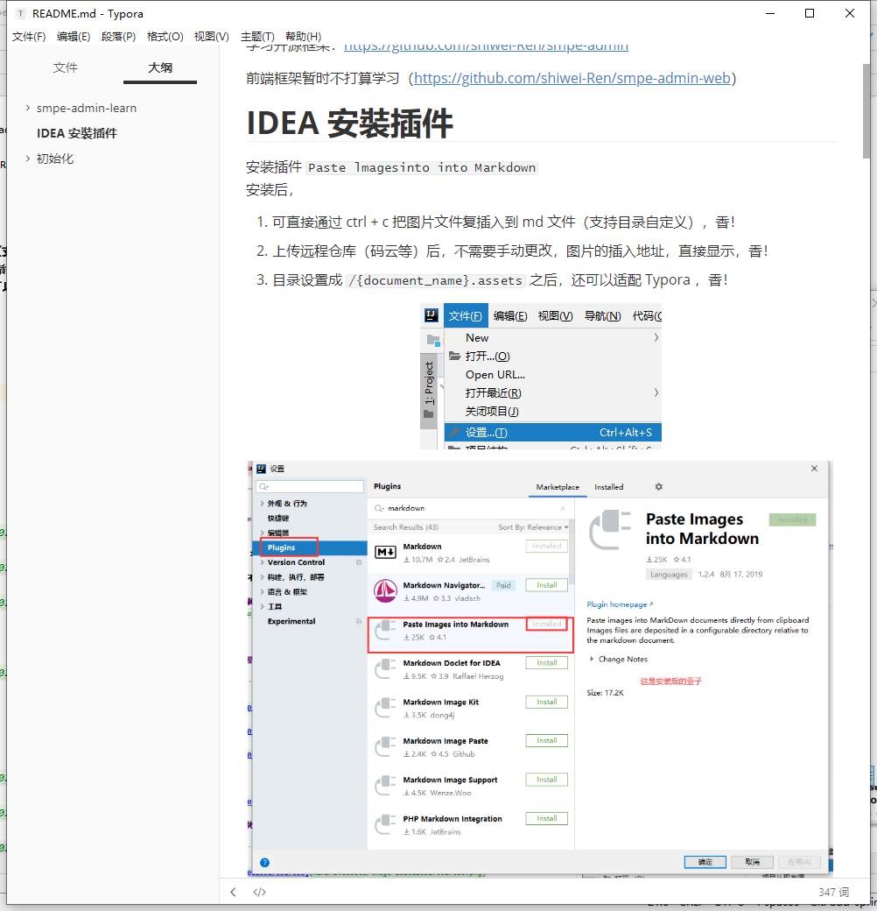
# 初始化

## 新建父工程

新建父工程：`smpe-admin-learn`

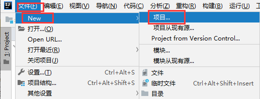

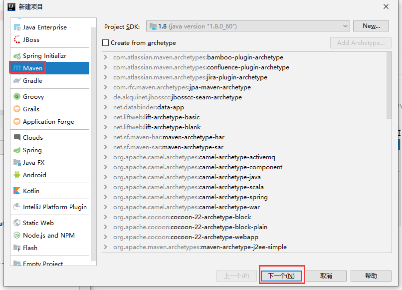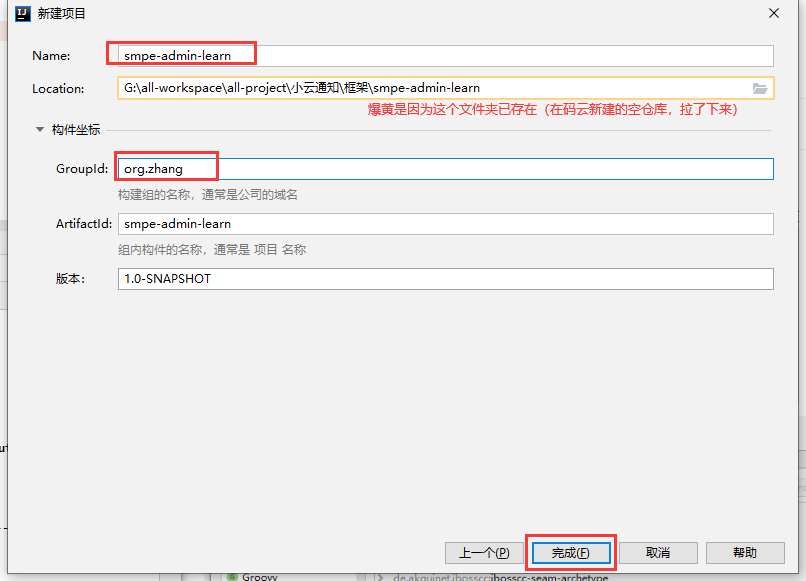

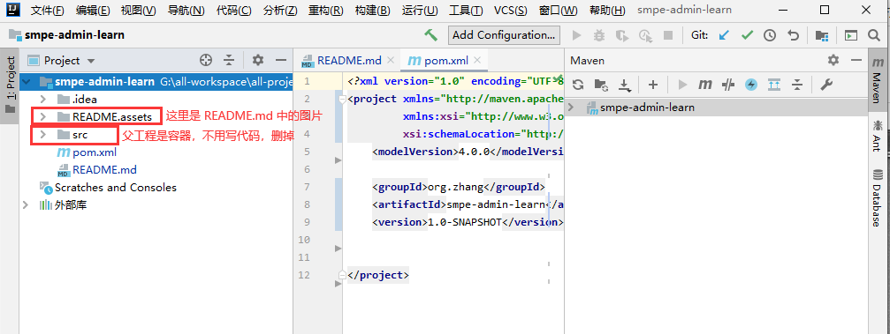

最终如图所示

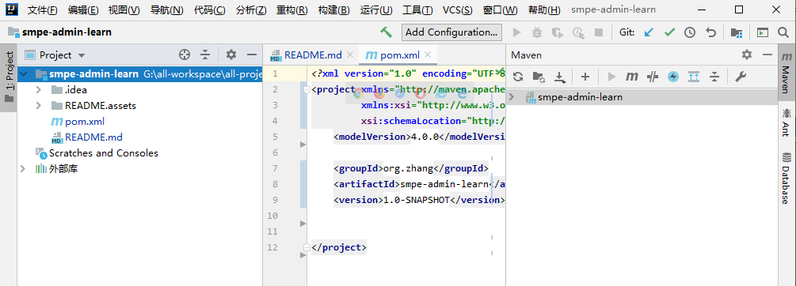

## 新建子模块

新建子模块：`smpe-common`

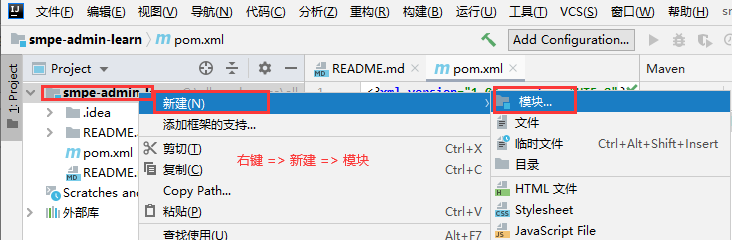


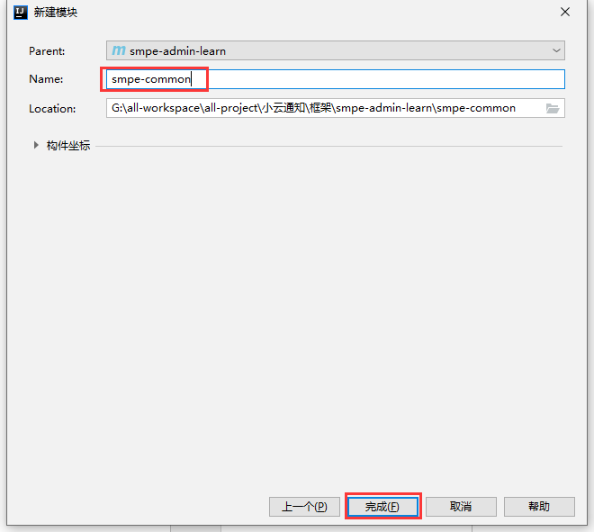

结果如图：

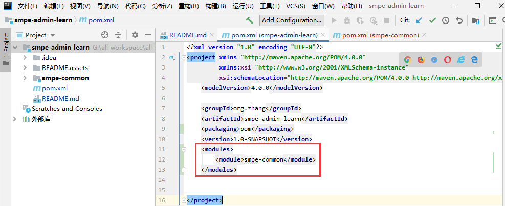

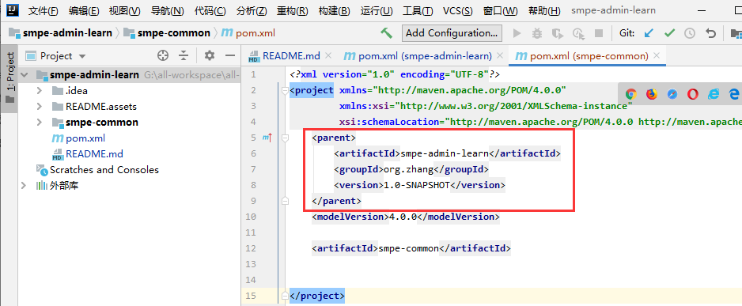

同上再创建子模块`smpe-system`

结果如图：

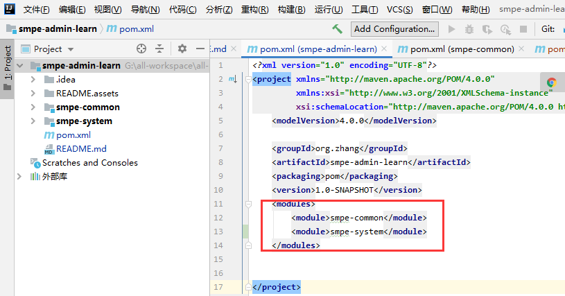

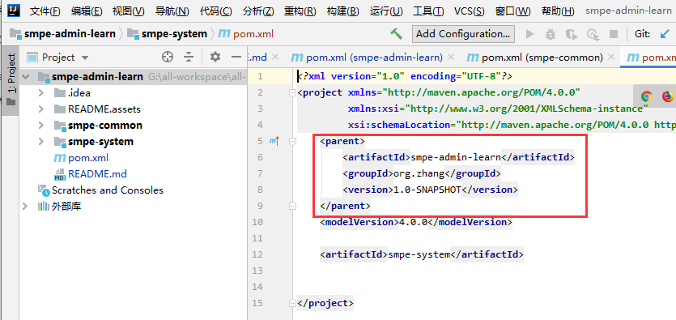

## 添加 springboot 依赖

在父工程的 pom.xml 里边添加依赖

```xml
<!-- 所有的springboot的工程都以spring父工程为父工程 -->
<parent>
    <groupId>org.springframework.boot</groupId>
    <artifactId>spring-boot-starter-parent</artifactId>
    <version>2.1.0.RELEASE</version>
</parent>

<dependencies>
    <!-- springboot web 启动器 -->
    <dependency>
        <groupId>org.springframework.boot</groupId>
        <artifactId>spring-boot-starter-web</artifactId>
    </dependency>
</dependencies>
```

在子工程 `smpe-system` 中添加启动类

```java

import org.springframework.boot.SpringApplication;
import org.springframework.boot.autoconfigure.SpringBootApplication;

/**
 * @ClassName; AppRun
 * @description: TODO SpringBoot 启动类
 * @Author: ZhangRenjie
 * @date: 2020/12/3 17:18
 */
@SpringBootApplication
public class AppRun {
    public static void main(String[] args) {
        SpringApplication.run(AppRun.class, args);
    }
}
```

启动效果：

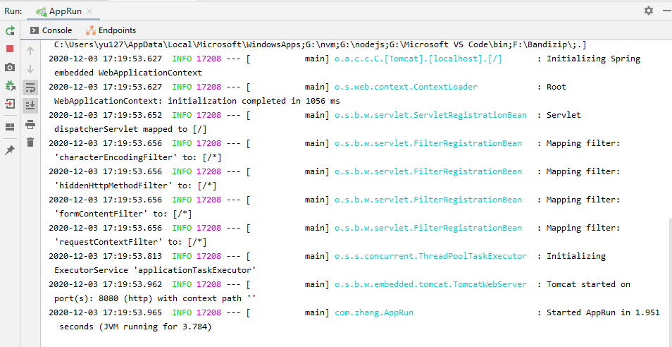

浏览器访问测试：访问到页面，服务启动成功。

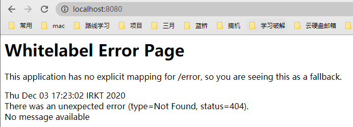

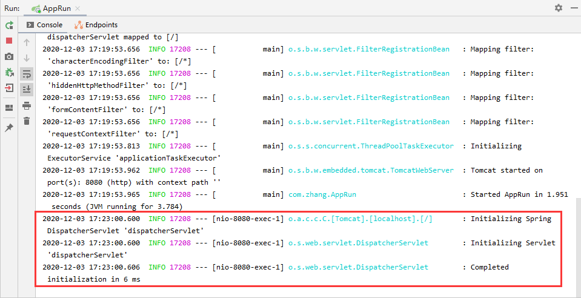

