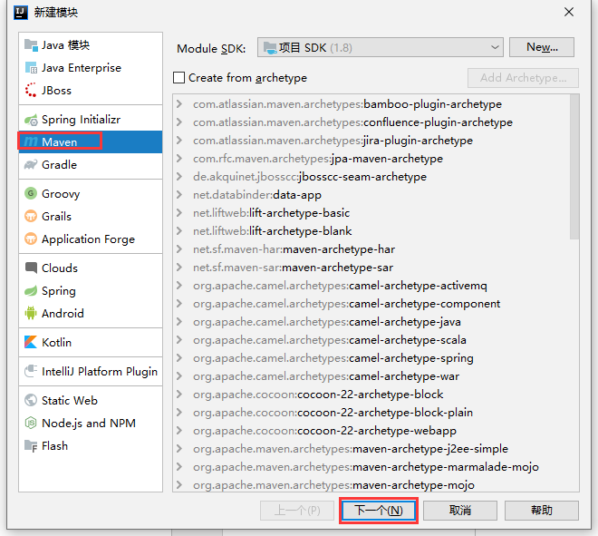

# smpe-admin-learn

#### 介绍
学习开源框架：https://github.com/shiwei-Ren/smpe-admin

前端框架暂时不打算学习（https://github.com/shiwei-Ren/smpe-admin-web）

# ▲ - 学习方式更改通知

到现在，才算梳理出**1个**接口

但是框架有用的接口有 **48个**

按照我的速度，**一天**什么事也不干，**全部精力**用来梳理接口，最多**只能梳理2、3个**，也就是说梳理完这个框架最少需要 **16天**

太慢！

所以我查了查框架的学习方式

[如何学习Java框架？](https://www.zhihu.com/question/277049419)


[怎么样去学习Java的框架比较好？](https://www.zhihu.com/question/62353598)


**所以决定改变一下学习模式：**不再着重去梳理框架方法，**着重学习**框架中自己**不会的知识**，简单来说就是，CTRL + 左键，点点点，看到不认识的，百度搜搜搜，然后总结总结总结！

所以后期可能少push，少更新了。。。

# 实现获取图片验证码接口

## 实现效果

前端项目可从`/api/auth/code`获取验证码


## 添加或修改git截图


## 添加或修改的文件树

```
- smpe-admin
	- smep-common
		- src.main
            - java
                - com.zhang
                    - nnotation 自定义注解包
                        - rest 匿名访问注解包
                            - AnonymousGetMapping 支持匿名访问  GetMapping
                        - AnonymousAccess 用于标记匿名访问方法
                    - enums 添加 - 自定义枚举类包
                        - ResultEnum 统一显影消息枚举
                    - exception 添加 - 封装异常包
                        - BadRequestException 通用请求异常
                    - response 封装返回数据包
                        - Result 对返回前端数据进行封装
                    - utils
                        - RedisUtils springData Redis 的工具类
                        - StringUtils 字符串工具类, 继承org.apache.commons.lang3.StringUtils类
        - pom.xml hutool工具包、redis 版本
    - smpe-system
    	- src.main
            - java
                - com.zhang
                    - modules
                        - security
                            - config
                                - bean
                                    - LoginCode 登录验证配置信息
                                    - LoginCodeEnum 验证码配置枚举
                                    - LoginProperties 从配置文件读取 login 配置
                                    - SecurityProperties 类描述Jwt参数配置 读取yml中对jwt的配置，注入到属性当中
                            - controller
                                - AuthorizationController 授权Controller
            - resources 资源包
                - config
                    application-dev.yml
		- pom.xml 引入图片验证码工具
	- pom.xml 锁定 hutool工具包、redis 版本
				
					
```

## 方法执行流程UML类图

精简版，只写了与`getCode`接口实现相关的成员变量和方法

 

## 具体修改文件

`smpe-admin-learn pom.xml` —— 父工程的 xml文件

1. 移除各种依赖，只做版本锁定。

2. 添加图片验证、huutool工具版本锁定

   ```xml
   <dependencyManagement>
       <dependencies>
           <!--图片验证码 start-->
           <dependency>
               <groupId>com.github.whvcse</groupId>
               <artifactId>easy-captcha</artifactId>
               <version>${captcha.version}</version>
           </dependency>
           <!--图片验证码 end-->
   
           <!--java 工具包 start-->
           <dependency>
               <groupId>cn.hutool</groupId>
               <artifactId>hutool-all</artifactId>
               <version>${hutool.version}</version>
           </dependency>
           <!--java 工具包 end-->
       </dependencies>
   </dependencyManagement>
   ```

   

`smpe-common` 模块 pom.xml 文件

1. 将原父工程引入的依赖移过来

   ```xml
   <!--引入依赖-->
       <dependencies>
   
           <!--lombok start-->
           <dependency>
               <groupId>org.projectlombok</groupId>
               <artifactId>lombok</artifactId>
               <version>${lombok.version}</version>
           </dependency>
           <!--lombok end-->
   
           <!--swagger start-->
           <dependency>
               <groupId>io.springfox</groupId>
               <artifactId>springfox-swagger2</artifactId>
               <version>${swagger.version}</version>
           </dependency>
           <dependency>
               <groupId>io.springfox</groupId>
               <artifactId>springfox-swagger-ui</artifactId>
               <version>${swagger.version}</version>
           </dependency>
           <!--swagger end-->
   
           <!-- springboot web 启动器 start-->
           <dependency>
               <groupId>org.springframework.boot</groupId>
               <artifactId>spring-boot-starter-web</artifactId>
           </dependency>
           <!-- springboot web 启动器 end-->
   
           <!--java-hutool 工具包 start-->
           <dependency>
               <groupId>cn.hutool</groupId>
               <artifactId>hutool-all</artifactId>
               <version>${hutool.version}</version>
           </dependency>
           <!--java-hutool 工具包 end-->
   
           <!--redis start-->
           <dependency>
               <groupId>org.springframework.boot</groupId>
               <artifactId>spring-boot-starter-data-redis</artifactId>
           </dependency>
           <!--redis end-->
       </dependencies>
   ```

   

`smpe-system`的 application-dev.yml

1. 添加了登录相关配置、添加了jwt相关配置

   ```yaml
   # 登录相关配置
   login:
     # 登录缓存
     cache-enable: true
     #  是否限制单用户登录
     single-login: false
     #  验证码
     login-code:
       #  验证码类型配置 查看 LoginProperties 类
       code-type: arithmetic
       #  登录图形验证码有效时间/分钟
       expiration: 2
       #  验证码高度
       width: 111
       #  验证码宽度
       heigth: 36
       # 内容长度
       length: 2
       # 字体名称，为空则使用默认字体
       font-name:
       # 字体大小
       font-size: 25
   
   jwt:
     header: Authorization
     # 令牌前缀
     token-start-with: Bearer
     # 必须使用最少88位的Base64对该令牌进行编码
     base64-secret: ZmQ0ZGI5NjQ0MDQwY2I4MjMxY2Y3ZmI3MjdhN2ZmMjNhODViOTg1ZGE0NTBjMGM4NDA5NzYxMjdjOWMwYWRmZTBlZjlhNGY3ZTg4Y2U3YTE1ODVkZDU5Y2Y3OGYwZWE1NzUzNWQ2YjFjZDc0NGMxZWU2MmQ3MjY1NzJmNTE0MzI=
     # 令牌过期时间 单位毫秒 默认4小时
     token-validity-in-seconds: 14400000
     # 在线用户 key
     online-key: online-token-
     # 验证码
     code-key: code-key-
     # token 持续检查时间范围（默认30分钟，单位毫秒），在token即将过期时用户有操作，给token续期
     detect: 1800000
     # 续期时间范围，默认1小时，单位毫秒
     renew: 3600000
   ```

2. 添加图片验证依赖

   ```xml
   <dependencies>
       <!--图片验证码 start-->
       <dependency>
           <groupId>com.github.whvcse</groupId>
           <artifactId>easy-captcha</artifactId>
       </dependency>
       <!--图片验证码 end-->
   </dependencies>
   ```

   

具体增加文件

`com.zhang.annotation.AnonymousAccess`

```java
package com.zhang.annotation;

import java.lang.annotation.*;

/**
 * ClassName AnonymousAccess
 * Description TODO 类描述：用于标记匿名访问方法
 *
 * @author ZhangRenjie
 * Date  2020/12/24 15:01
 */
@Inherited
@Documented
@Target({ElementType.METHOD, ElementType.ANNOTATION_TYPE})
@Retention(RetentionPolicy.RUNTIME)
public @interface AnonymousAccess {
}
```

`com.zhang.annotation.rest.AnonymousGetMapping`

```java
package com.zhang.annotation.rest;

import com.zhang.annotation.AnonymousAccess;
import org.springframework.core.annotation.AliasFor;
import org.springframework.web.bind.annotation.RequestMapping;
import org.springframework.web.bind.annotation.RequestMethod;

import java.lang.annotation.*;

/**
 * ClassName AnonymousGetMapping
 * Description TODO 类描述：支持匿名访问  GetMapping
 *
 * @author ZhangRenjie
 * Date  2020/12/24 15:01
 */
@AnonymousAccess
@Target(ElementType.METHOD)
@Retention(RetentionPolicy.RUNTIME)
@Documented
@RequestMapping(method = RequestMethod.GET)
public @interface AnonymousGetMapping {
    /**
     * Alias for {@link RequestMapping#name}.
     */
    @AliasFor(annotation = RequestMapping.class)
    String name() default "";

    /**
     * Alias for {@link RequestMapping#value}.
     */
    @AliasFor(annotation = RequestMapping.class)
    String[] value() default {};

    /**
     * Alias for {@link RequestMapping#path}.
     */
    @AliasFor(annotation = RequestMapping.class)
    String[] path() default {};

    /**
     * Alias for {@link RequestMapping#params}.
     */
    @AliasFor(annotation = RequestMapping.class)
    String[] params() default {};

    /**
     * Alias for {@link RequestMapping#headers}.
     */
    @AliasFor(annotation = RequestMapping.class)
    String[] headers() default {};

    /**
     * Alias for {@link RequestMapping#consumes}.
     *
     * @since 4.3.5
     */
    @AliasFor(annotation = RequestMapping.class)
    String[] consumes() default {};

    /**
     * Alias for {@link RequestMapping#produces}.
     */
    @AliasFor(annotation = RequestMapping.class)
    String[] produces() default {};
}
```


`com.zhang.enums.ResultEnum`

```java
package com.zhang.enums;

import lombok.AllArgsConstructor;
import lombok.Getter;
import lombok.NoArgsConstructor;

/**
 * ClassName ResultEnum
 * Description TODO 类描述：统一显影消息枚举
 *
 * @author ZhangRenjie
 * Date  2020/12/24 9:45
 */
@Getter
@NoArgsConstructor
@AllArgsConstructor
public enum ResultEnum {

    SUCCESS(0, "SUCCESS")
    ;

    private int code;

    private String msg;
}
```


`com.zhang.exception.BadRequestException`

```java
package com.zhang.exception;

import com.zhang.enums.ResultEnum;

import static org.springframework.http.HttpStatus.BAD_REQUEST;

/**
 * ClassName BadRequestException
 * Description TODO 类描述：通用请求异常
 *
 * @author ZhangRenjie
 * Date  2020/12/24 11:15
 */
public class BadRequestException extends RuntimeException {
    private Integer status = BAD_REQUEST.value();
    public BadRequestException(String msg) {
        super(msg);
    }
    public BadRequestException(Integer status, String msg) {
        super(msg);
        this.status = status;
    }
    public BadRequestException(ResultEnum resultEnum) {
        super(resultEnum.getMsg());
        this.status = resultEnum.getCode();
    }
}
```


`com.zhang.response.Result`

```java
package com.zhang.response;

import com.zhang.enums.ResultEnum;
import lombok.AllArgsConstructor;
import lombok.Data;

import java.util.Map;

/**
 * ClassName Result
 * Description TODO 类描述：对返回前端数据进行封装
 *
 * @author ZhangRenjie
 * Date  2020/12/24 9:39
 */
@Data
@AllArgsConstructor
public class Result<T> {

    private Integer code;
    private String message;
    private T data;

    /**
     * Description //TODO 成功，只返回状态码和响应信息，没有返回数据
     * @return Result<E> 封装返回的状态码和响应信息
     * @author ZhangRenJie
     * @date 2021/1/20 8:24
     */
    public static <E> Result<E> success(){
        return new Result<>(ResultEnum.SUCCESS.getCode(), ResultEnum.SUCCESS.getMsg(), null);
    }

    /**
     * Description //TODO 成功并封装返回数据
     * @param data 返回数据
     * @return Result<E> 封装返回的数据
     * @author ZhangRenJie
     * @date 2021/1/20 8:24
     */
    public static <E> Result<E> success(E data) {
        return new Result<>(ResultEnum.SUCCESS.getCode(), ResultEnum.SUCCESS.getMsg(), data);
    }
}
```


`com.zhang.utils.RedisUtils`

```java
package com.zhang.utils;

import lombok.RequiredArgsConstructor;
import lombok.extern.slf4j.Slf4j;
import org.springframework.data.redis.core.RedisTemplate;
import org.springframework.stereotype.Component;

import java.util.concurrent.TimeUnit;

/**
 * ClassName RedisUtils
 * Description TODO 类描述 SpringData Redis 的工具类
 *
 * @author ZhangRenjie
 * Date  2021/1/19 15:59
 */
@RequiredArgsConstructor
@Component
@SuppressWarnings({"unchecked","all"})
@Slf4j
public class RedisUtils {
    
    private final RedisTemplate<Object, Object> redisTemplate;
    
    /**
     * Description //TODO 存入 redis，并设置过期时间
     * @param key 键
     * @param value 值
     * @param time 过期时间
     * @param timeUnit 类型
     * @return boolean 是否存入成功
     * @author ZhangRenJie
     * @date 2021/1/20 8:13
     */
    public boolean set(String key, Object value, long time, TimeUnit timeUnit) {
        try {
            if (time > 0) {
                redisTemplate.opsForValue().set(key, value, time, timeUnit);
            } else {
                set(key, value);
            }
            return true;
        } catch (Exception e) {
            e.printStackTrace();
            return false;
        }
    }

    /**
     * Description //TODO 普通 redis 存入
     * @param key 键
     * @param value 值
     * @return boolean 是否存入成功
     * @author ZhangRenJie
     * @date 2021/1/20 8:07
     */
    private boolean set(String key, Object value) {
        try {
            redisTemplate.opsForValue().set(key, value);
            return true;
        } catch (Exception e) {
            e.printStackTrace();
            return false;
        }
    }
}
```


`com.zhang.utils.StringUtils`

```java
package com.zhang.utils;

import cn.hutool.core.util.StrUtil;

/**
 * ClassName StringUtils
 * Description TODO 类描述：字符串工具类, 继承org.apache.commons.lang3.StringUtils类
 *
 * @author ZhangRenjie
 * Date  2020/12/24 14:41
 */
public class StringUtils extends StrUtil {
}
```


`com.zhang.modules.security.config.bean.LoginCode`

```java
package com.zhang.modules.security.config.bean;

import lombok.Data;

/**
 * ClassName LoginCode
 * Description TODO 类描述： 登录验证配置信息
 *
 * @author ZhangRenjie
 * Date  2020/12/24 10:20
 */
@Data
public class LoginCode {

    /**
     * 验证码配置
     */
    private LoginCodeEnum codeType;
    /**
     * 验证码有效时间 分钟
     */
    private Long expiration = 2L;
    /**
     * 验证码内容长度
     */
    private int length = 2;
    /**
     * 验证码码宽度
     */
    private int width = 111;
    /**
     * 验证码高度
     */
    private int height = 36;
    /**
     * 验证码字体
     */
    private String fontName;
    /**
     * 字体大小
     */
    private int fontSize = 25;

    public LoginCodeEnum getCodeType() {
        return codeType;
    }
}
```


`com.zhang.modules.security.config.bean.LoginCodeEnum`

```java
package com.zhang.modules.security.config.bean;

/**
 * ClassName LoginCodeEnum
 * Description TODO 类描述：验证码配置枚举
 *
 * @author ZhangRenjie
 * Date  2020/12/24 10:22
 */
public enum LoginCodeEnum {
    /**
     * 算数
     */
    arithmetic,
    /**
     * 中文
     */
    chinese,
    /**
     * 中文闪图
     */
    chinese_gif,
    /**
     * 闪图
     */
    gif,
    spec
}
```


`com.zhang.modules.security.config.bean.LoginProperties`

```java
package com.zhang.modules.security.config.bean;

import com.wf.captcha.*;
import com.wf.captcha.base.Captcha;
import com.zhang.exception.BadRequestException;
import com.zhang.utils.StringUtils;
import lombok.Data;
import org.springframework.boot.context.properties.ConfigurationProperties;
import org.springframework.context.annotation.Configuration;

import java.awt.*;
import java.util.Objects;

/**
 * ClassName LoginProperties
 * Description TODO 类描述：从配置文件读取 login 配置
 *
 * @author ZhangRenjie
 * Date  2020/12/24 10:17
 */
@Data
@Configuration

@ConfigurationProperties(prefix = "login")
public class LoginProperties {

    /**
     * 账号单用户 登录
     */
    private  boolean singleLogin = false;

    private  LoginCode loginCode;
    /**
     * 用户登录信息缓存
     */
    private boolean cacheEnable;

    public boolean isSingleLogin(){
        return singleLogin;
    }

    public boolean isCacheEnable(){
        return cacheEnable;
    }

    /**
     * Description //TODO 获取验证码生产类
     * @return com.wf.captcha.base.Captcha
     * @author ZhangRenJie
     * @date 2020/12/24 11:07
     **/
    public Captcha getCaptcha() {
        if (Objects.isNull(loginCode)) {
            loginCode = new LoginCode();
            if (Objects.isNull(loginCode.getCodeType())) {
                loginCode.setCodeType(LoginCodeEnum.arithmetic);
            }
        }
        return switchCaptcha(loginCode);
    }

    /**
     * Description //TODO 依据配置信息生产验证码
     * @param loginCode 登录验证配置信息
     * @return com.wf.captcha.base.Captcha
     * @author ZhangRenJie
     * @date 2020/12/24 11:10
     **/
    private Captcha switchCaptcha(LoginCode loginCode) {

        Captcha captcha;
        synchronized (this) {
            switch (loginCode.getCodeType()) {
                case arithmetic:
                    captcha = new ArithmeticCaptcha(loginCode.getWidth(), loginCode.getHeight());
                    captcha.setLen(loginCode.getLength());
                    break;
                case chinese:
                    captcha = new ChineseCaptcha(loginCode.getWidth(), loginCode.getHeight());
                    captcha.setLen(loginCode.getLength());
                    break;
                case chinese_gif:
                    captcha = new ChineseGifCaptcha(loginCode.getWidth(), loginCode.getHeight());
                    captcha.setLen(loginCode.getLength());
                    break;
                case gif:
                    captcha = new GifCaptcha(loginCode.getWidth(), loginCode.getHeight());
                    captcha.setLen(loginCode.getLength());
                    break;
                case spec:
                    captcha = new SpecCaptcha(loginCode.getWidth(), loginCode.getHeight());
                    captcha.setLen(loginCode.getLength());
                    break;
                default:
                    throw new BadRequestException("验证码配置信息错误！正确配置查看 LoginCodeEnum ");
            }
        }
        if (StringUtils.isNotBlank(loginCode.getFontName())) {
            captcha.setFont((new Font(loginCode.getFontName(), Font.PLAIN, loginCode.getFontSize())));
        }
        return captcha;
    }
}
```


`com.zhang.modules.security.config.bean.SecurityProperties`

```java
package com.zhang.modules.security.config.bean;

import lombok.Data;
import org.springframework.boot.context.properties.ConfigurationProperties;
import org.springframework.context.annotation.Configuration;

/**
 * ClassName SecurityProperties
 * Description TODO 类描述Jwt参数配置 读取yml中对jwt的配置，注入到以下属性当中
 *
 * @author ZhangRenjie
 * Date  2021/1/19 14:49
 */
@Data
@ConfigurationProperties(prefix = "jwt")
@Configuration
public class SecurityProperties {

    /**
     * Request Hadders : Authorization
     */
    private String header;

    /**
     * 令牌前缀，最后留个空格 Bearer
     */
    private String tokenStartWith;

    /**
     * 必须使用最少88位的Base64对该令牌进行编码
     */
    private String base64Secret;

    /**
     * 令牌过期时间，单位毫秒
     */
    private Long tokenValidityInSeconds;

    /**
     * 在线用户 key，根据 key 查新 redis 中在线用户的数据
     */
    private String onlineKey;

    /**
     * 验证码 key
     */
    private String codeKey;

    /**
     * token 续期检查
     */
    private Long detect;

    /**
     * 续期时间
     */
    private Long renew;

    /**
     * 重写get方法，加入空格，防止空格造成影响
     */
    public String getTokenStartWith() {
        return tokenStartWith + " ";
    }
}
```


`com.zhang.modules.security.controller.AuthorizationController`

```java
package com.zhang.modules.security.controller;

import cn.hutool.core.util.IdUtil;
import com.wf.captcha.base.Captcha;
import com.zhang.annotation.rest.AnonymousGetMapping;
import com.zhang.modules.security.config.bean.LoginCodeEnum;
import com.zhang.modules.security.config.bean.LoginProperties;
import com.zhang.modules.security.config.bean.SecurityProperties;
import com.zhang.response.Result;
import com.zhang.utils.RedisUtils;
import io.swagger.annotations.Api;
import io.swagger.annotations.ApiOperation;
import lombok.RequiredArgsConstructor;
import lombok.extern.slf4j.Slf4j;
import org.springframework.web.bind.annotation.RequestMapping;
import org.springframework.web.bind.annotation.RestController;

import java.util.HashMap;
import java.util.Map;
import java.util.concurrent.TimeUnit;

/**
 * ClassName AuthorizationController
 * Description TODO 类描述： 授权接口
 *
 * @author ZhangRenjie
 * Date  2020/12/24 9:35
 */
@Slf4j
@RestController
@RequestMapping("/api/auth")
// 会生成一个包含常量，和标识了NotNull的变量的构造方法。生成的构造方法是私有的private。
@RequiredArgsConstructor
@Api(tags = "系统：系统授权接口")
public class AuthorizationController {

    private final LoginProperties loginProperties;
    private final SecurityProperties properties;
    private final RedisUtils redisUtils;


    @ApiOperation("获取验证码")
    @AnonymousGetMapping(value = "/code")
    public Result<Map<String, Object>> getCode(){
        Captcha captcha = loginProperties.getCaptcha();
        String uuid = properties.getCodeKey() + IdUtil.simpleUUID();
        // 当验证码类型为 arithmetic 时且长度 >= 2 时，captcha.text()的结果有几率为浮点型
        String captchaValue = captcha.text();
        if (captcha.getCharType() -1 == LoginCodeEnum.arithmetic.ordinal() & captchaValue.contains(".")) {
            captchaValue = captchaValue.split("\\.")[0];
        }
        // 保存
        redisUtils.set(uuid, captchaValue, loginProperties.getLoginCode().getExpiration(), TimeUnit.MINUTES);
        log.info("登录图片验证码结果：" + captchaValue);
        // 验证码信息
        Map<String, Object> imgResult = new HashMap<String, Object>(2){{
            put("img", captcha.toBase64());
            put("uuid", uuid);
        }};
        return Result.success(imgResult);
    }

}
```


# 配置 swagger && git排除规则文件 `.gitignore`

## git排除项
`.gitignore`
```gitignore
### IntelliJ IDEA ###
.idea
*.iws
*.iml
*.ipr
/logs/
/upload/
*/target/

# Compiled class file
*.class

# Log file
*.log

# BlueJ files
*.ctxt

# Mobile Tools for Java (J2ME)
.mtj.tmp/

# Package Files #
*.jar
*.war
*.nar
*.ear
*.zip
*.tar.gz
*.rar

# virtual machine crash logs, see http://www.java.com/en/download/help/error_hotspot.xml
hs_err_pid*

```
## 添加依赖
`spem-admin-learn/pom.xml`
```xml
<!--我的配置-->
<!--声明变量，用于统一控制版本-->
<properties>

    <!--文件编码格式 start-->
    <project.build.sourceEncoding>UTF-8</project.build.sourceEncoding>
    <project.reporting.outputEncoding>UTF-8</project.reporting.outputEncoding>
    <!--文件编码格式 end-->

    <!--jdk 版本 start-->
    <java.version>1.8</java.version>
    <!--jdk 版本 end-->

    <!--以上变量是给其他依赖声明的，否则可能会出现乱码、报错等，可以更改为 GBK 测试（自定义日志乱码）-->

    <swagger.version>2.9.2</swagger.version>
    <lombok.version>1.18.8</lombok.version>
</properties>

<!--
该节点下的依赖关系只是为了统一版本号，
子项目添加依赖时，只能选择这个标签中的版本，否则会报错；
该节点中的依赖关系子项目不会自动继承，除非子项目主动引用；

如果一些依赖，只是某几个子项目需要，其他项目不需要，可以在这里进行版本锁定，
以防子项目引入不同版本的依赖，造成问题，同时在这里锁定后，子项目可以不用写版本号
-->
<dependencyManagement>
    <dependencies>
        <!--lombok start-->
        <dependency>
            <groupId>org.projectlombok</groupId>
            <artifactId>lombok</artifactId>
            <version>${lombok.version}</version>
        </dependency>
        <!--lombok end-->

        <!--swagger start-->
        <dependency>
            <groupId>io.springfox</groupId>
            <artifactId>springfox-swagger2</artifactId>
            <version>${swagger.version}</version>
        </dependency>
        <dependency>
            <groupId>io.springfox</groupId>
            <artifactId>springfox-swagger-ui</artifactId>
            <version>${swagger.version}</version>
        </dependency>
        <!--swagger end-->
    </dependencies>
</dependencyManagement>

<!--引入依赖-->
<dependencies>

    <!--lombok start-->
    <dependency>
        <groupId>org.projectlombok</groupId>
        <artifactId>lombok</artifactId>
        <version>${lombok.version}</version>
    </dependency>
    <!--lombok end-->

    <!--swagger start-->
    <dependency>
        <groupId>io.springfox</groupId>
        <artifactId>springfox-swagger2</artifactId>
        <version>${swagger.version}</version>
    </dependency>
    <dependency>
        <groupId>io.springfox</groupId>
        <artifactId>springfox-swagger-ui</artifactId>
        <version>${swagger.version}</version>
    </dependency>
    <!--swagger end-->

    <!-- springboot web 启动器 -->
    <dependency>
        <groupId>org.springframework.boot</groupId>
        <artifactId>spring-boot-starter-web</artifactId>
    </dependency>
</dependencies>


<!--框架配置，（未采用）-->

<!--规定版本-->
<properties>
    <swagger.version>2.9.2</swagger.version>
    <swagger.models.version>1.5.21</swagger.models.version>
    <swagger.annotations.version>1.5.21</swagger.annotations.version>
</properties>


<!--问题在下边的注释里边写的很清楚，而且eladmin官网也是这样引入配置的，
但是我测试了一下没试出来bug，暂时不这样搞了-->
<!-- swagger start -->
<dependency>
    <groupId>io.springfox</groupId>
    <artifactId>springfox-swagger2</artifactId>
    <version>${swagger.version}</version>
    <!--Swagger异常：AbstractSerializableParameter : Illegal DefaultValue null for parameter type integer
        由于实体类使用@ApiModelProperty时，example属性没有赋值导致的，会进行非空判断
        解决： 排除后，上传更高版本

        https://blog.csdn.net/qq_17589751/article/details/105855854
        exclusions 这个标签的作用是排除关联依赖的引入，因为maven的pom依赖其中有一点是将关联的依赖全都引入进来 ，
        这个标签在这的作用就是 如果关联的依赖和引入的其他依赖可能存在冲突，
        就必须将关联的依赖排除掉，所以就用这个标签。
        另外这个＋s的，大家应该也明白 ，就是可以包含多个吗！！！！
    -->
    <exclusions>
        <exclusion>
            <groupId>io.swagger</groupId>
            <artifactId>swagger-annotations</artifactId>
        </exclusion>
        <exclusion>
            <groupId>io.swagger</groupId>
            <artifactId>swagger-models</artifactId>
        </exclusion>
    </exclusions>
</dependency>
<dependency>
    <groupId>io.swagger</groupId>
    <artifactId>swagger-annotations</artifactId>
    <version>${swagger.annotations.version}</version>
</dependency>
<dependency>
    <groupId>io.swagger</groupId>
    <artifactId>swagger-models</artifactId>
    <version>${swagger.models.version}</version>
</dependency>

<dependency>
    <groupId>io.springfox</groupId>
    <artifactId>springfox-swagger-ui</artifactId>
    <version>${swagger.version}</version>
</dependency>
<!-- swagger end -->
<!--lombok插件-->
<dependency>
    <groupId>org.projectlombok</groupId>
    <artifactId>lombok</artifactId>
    <!--
    optional 依赖传递的可选属性
    true 表示不传递依赖。
    但是，父子工程中，子工程也不会继承这个依赖吗？
    system 模块，xml 文件没有引入 lombok 插件，但有使用 lombok 的注解，
    optional 对父子工程不起作用
    http://www.360doc.com/content/17/0605/10/14808334_660126478.shtml
    -->
    <optional>true</optional>
</dependency>
```
## 添加 yml 配置
设置启动模式：`smpe-system/src/main/resources/config/application.yml`
```yaml
spring:
  profiles:
    active: dev
```
设置端口、swagger配置：`smpe-system/src/main/resources/config/application-dev.yml`
```yaml
server:
  port: 8080

swagger:
  enabled: true
  host: 127.0.0.1:${server.port}
  description: 一个简单且易上手的 Spring boot 后台管理框架
  title: SMPE-ADMIN 接口文档
  version: @project.version@
```
`smpe-system/src/main/resources/config/application-prod.yml`文件没有添加内容
## 添加配置类
获取yml文件swagger配置信息：`smpe-common/src/main/java/com/zhang/config/bean/SwaggerProperties.java`
```java
package com.zhang.config.bean;

import lombok.Data;
import org.springframework.boot.context.properties.ConfigurationProperties;
import org.springframework.context.annotation.Configuration;

/**
 * @ClassName; SwaggerProperties
 * @description: TODO Swagger配置，从yml读取
 * @Author: ZhangRenjie
 * @date: 2020/12/4 20:00
 */
@Data
@Configuration
@ConfigurationProperties(prefix = "swagger")
public class SwaggerProperties {

    /** 是否启用swagger */
    private Boolean enabled;

    /** 描述 */
    private String description;

    /** 标题 */
    private String title;

    /** 版本 */
    private String version;

    /** ip和host */
    private String swaggerHost;
}
```
配置swagger：`smpe-common/src/main/java/com/zhang/config/SwaggerConfig.java`
```java
package com.zhang.config;

import com.google.common.base.Predicates;
import com.zhang.config.bean.SwaggerProperties;
import lombok.RequiredArgsConstructor;
import org.springframework.context.annotation.Bean;
import org.springframework.context.annotation.Configuration;
import springfox.documentation.builders.ApiInfoBuilder;
import springfox.documentation.builders.PathSelectors;
import springfox.documentation.builders.RequestHandlerSelectors;
import springfox.documentation.service.ApiInfo;
import springfox.documentation.service.Contact;
import springfox.documentation.spi.DocumentationType;
import springfox.documentation.spring.web.plugins.Docket;
import springfox.documentation.swagger2.annotations.EnableSwagger2;

import java.util.ArrayList;

/**
 * @ClassName; SwaggerConfig
 * @description: TODO 类描述
 * @Author: ZhangRenjie
 * @date: 2020/12/3 20:03
 */
@RequiredArgsConstructor
@Configuration
@EnableSwagger2
public class SwaggerConfig {

    private final SwaggerProperties swaggerProperties;

    @Bean
    @SuppressWarnings("all")
    public Docket createRestApi(){
        return new Docket(DocumentationType.SWAGGER_2)
                .enable(swaggerProperties.getEnabled())
                .apiInfo(apiInfo())
                .host(swaggerProperties.getSwaggerHost())
                .select()
                .apis(RequestHandlerSelectors.basePackage("com.zhang"))
                .paths(Predicates.not(PathSelectors.regex("/error.*")))
                .build();
    }

    private ApiInfo apiInfo() {
        return new ApiInfo(
                swaggerProperties.getTitle(),
                swaggerProperties.getDescription(),
                swaggerProperties.getVersion(),
                "http://www.marchsoft.cn/",
                new Contact("我想做阿信","https://blog.csdn.net/qq_42909053","1273206268@qq.com"),
                "Apache 2.0",
                "http://www.apache.org/licenses/LICENSE-2.0",
                new ArrayList<>()

        );
    }
}
```
## system工程依赖common工程
让`smpe-system`依赖`smpe-common`，获取swagger配置类的信息：`smpe-system/pom.xml`
```xml
<dependencies>
    <dependency>
        <groupId>com.zhang</groupId>
        <artifactId>smpe-common</artifactId>
        <version>1.0-SNAPSHOT</version>
    </dependency>
</dependencies>
```
## 运行效果

# 准备数据库
数据库名 `smpe`

sql文件：


使用方法：
1. 打开 navicat 
2. 打开本地连接
3. 新建名为：`smpe`的库
4. 执行sql文件
5. 如图：


# IDEA 安裝插件 
安装插件 `Paste lmagesinto into Markdown`
安装后，
1. 可直接通过 ctrl + c 把图片文件复插入到 md 文件（支持目录自定义），香！
2. 上传远程仓库（码云等）后，不需要手动更改，图片的插入地址，直接显示，香！
3. 目录设置成 `/{document_name}.assets` 之后，还可以适配 Typora ，香！


效果如图：


# 初始化

## 新建父工程

新建父工程：`smpe-admin-learn`


最终如图所示


## 新建子模块

新建子模块：`smpe-common`





结果如图：


同上再创建子模块`smpe-system`

结果如图：


## 添加 springboot 依赖

在父工程的 pom.xml 里边添加依赖

```xml
<!-- 所有的springboot的工程都以spring父工程为父工程 -->
<parent>
    <groupId>org.springframework.boot</groupId>
    <artifactId>spring-boot-starter-parent</artifactId>
    <version>2.1.0.RELEASE</version>
</parent>

<dependencies>
    <!-- springboot web 启动器 -->
    <dependency>
        <groupId>org.springframework.boot</groupId>
        <artifactId>spring-boot-starter-web</artifactId>
    </dependency>
</dependencies>
```

在子工程 `smpe-system` 中添加启动类

```java

import org.springframework.boot.SpringApplication;
import org.springframework.boot.autoconfigure.SpringBootApplication;

/**
 * @ClassName; AppRun
 * @description: TODO SpringBoot 启动类
 * @Author: ZhangRenjie
 * @date: 2020/12/3 17:18
 */
@SpringBootApplication
public class AppRun {
    public static void main(String[] args) {
        SpringApplication.run(AppRun.class, args);
    }
}
```

启动效果：


浏览器访问测试：访问到页面，服务启动成功。


